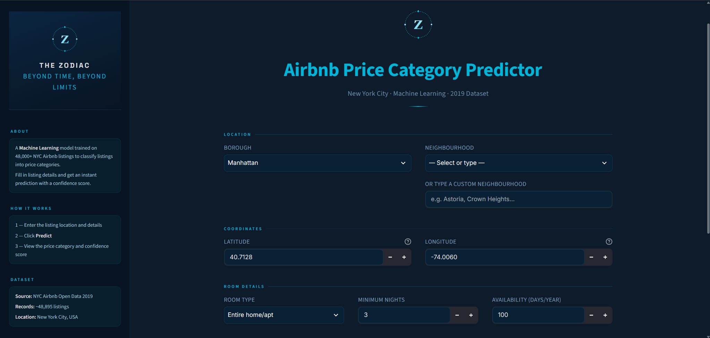
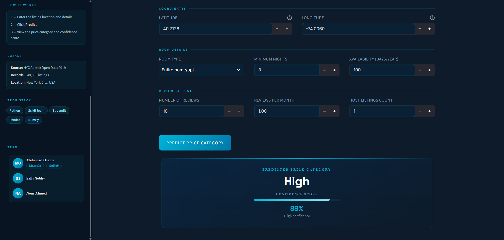

# Airbnb Price Category Predictor

A Machine Learning model that classifies Airbnb listings in New York City into price categories based on listing data — with an interactive UI built with Streamlit.

---

## Demo




---

## Overview

| | |
|---|---|
| **Dataset** | NYC Airbnb Open Data 2019 |
| **Records** | ~48,895 listings |
| **Location** | New York City, USA |
| **Model** | Classification — Price Category Prediction |

---

## How It Works

1. Enter the listing location and details
2. Click **Predict**
3. View the price category and confidence score

---

## Tech Stack


---

## Project Structure

├── main.py                     # Streamlit app
├── AirBNB notebook.ipynb       # Data analysis & model training
├── airbnb_model.pkl            # Trained ML model
├── airbnb_preprocessor.pkl     # Data preprocessor
├── AB_NYC_2019.csv             # Dataset
├── assets/                     # Screenshots
└── requirements.txt            # Dependencies


---

## Run Locally

```bash
git clone https://github.com/mahamadj99/Airbnb-Price_Category-Predictor.git
cd Airbnb-Price_Category-Predictor
pip install -r requirements.txt
streamlit run main.py
```

---

## Team

| Name | |
|------|---|
| Mahamed Osama | [LinkedIn](https://www.linkedin.com/in/mahamed-osama-80b4ab3b1/) • [GitHub](https://github.com/mahamadj99) |
| Sally Sobhy | |
| Nour Ahmed | |
